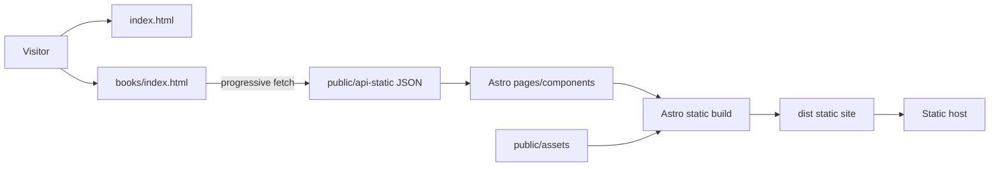

# Implementation Plan: Astro Site Migration Prototype

## Summary

Build a static Astro replacement for the existing Angular personal site. Reuse the public static data and image assets, preserve the visual direction, and implement the complete books journey with lightweight client-side JavaScript rather than shipping Angular runtime code.

## Technical Context

- Language/Version: TypeScript on Node.js 22
- Framework: Astro 7.3.5
- Storage: versioned JSON and image files under `public/`
- Testing: Node test runner plus production build and HTTP smoke tests
- Target Platform: static hosting and GitHub Pages
- Project Type: static content website
- Performance Goal: static HTML first, client JavaScript only for progressive book-page loading
- Security Constraints: no secrets; safe external links; no runtime backend
- Scale/Scope: current personal site and current book collection

## Architecture



The home page reads sample JSON at build time. The books page renders a static shell and uses a small browser module to load numbered JSON pages from newest to oldest. Shared layout and styles remain framework-native Astro/CSS.

## Contracts / Interfaces

- `GET /api-static/sample/post.json` returns writing-link records.
- `GET /api-static/sample/book.json` returns latest-book records.
- `GET /api-static/config.json` returns `{ "bookData": number }`.
- `GET /api-static/book/{running}.json` returns book records.
- Routes: `/` and `/books`.

## Error Handling & Observability

- Build-time imports fail loudly when required JSON is invalid.
- Client loader presents an inline error and retry action for failed page requests.
- Image failures retain a neutral cover placeholder.
- No remote telemetry is added in the prototype.

## Security Design

- No secrets, authentication, cookies, or server runtime.
- External links use `target="_blank"` with `rel="noopener noreferrer"`.
- Text is rendered through Astro or DOM text APIs rather than unsanitized HTML.

## Project Structure

```text
nutsathaporn-astro/
├── public/
│   ├── api-static/
│   └── assets/
├── src/
│   ├── components/
│   ├── layouts/
│   ├── pages/
│   │   ├── index.astro
│   │   └── books.astro
│   ├── scripts/
│   └── styles/
├── tests/
├── specs/001-astro-site-migration/
├── astro.config.mjs
├── package.json
└── README.md
```

## Tradeoffs / Alternatives Considered

- Decision: create an independent Astro repository.
  - Rationale: allows an isolated comparison and avoids disrupting production Angular code.
  - Alternative rejected: in-place Angular replacement, because rollback and comparison would be harder.
- Decision: use Astro plus browser-native JavaScript for incremental loading.
  - Rationale: minimizes client runtime and avoids adding a second UI framework.
  - Alternative rejected: React/Vue island, because current interaction does not justify the dependency.
- Decision: copy static data for the prototype.
  - Rationale: makes the new repository independently buildable.
  - Tradeoff: data can drift until a single-source publishing workflow is designed.

## Validation Plan

1. Validate copied JSON syntax and record schema.
2. Reconcile source and destination JSON/image inventory.
3. Run automated tests for sorting, pagination order, and date formatting.
4. Run `npm run check`.
5. Run `npm test`.
6. Run `npm run build`.
7. Start production preview and request `/`, `/books`, config JSON, and a book cover.
8. Inspect the final Git diff and open a Pull Request without merging.
